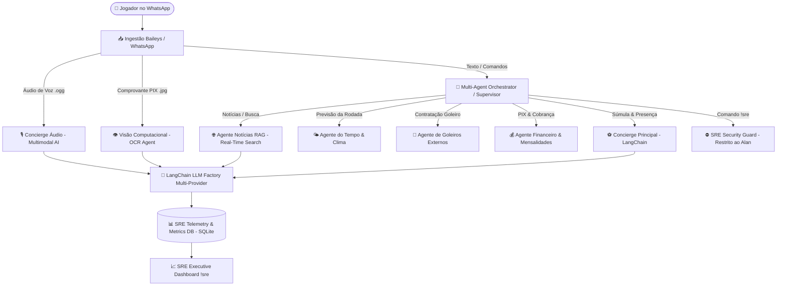

# ⚽ Joga10-AI — Sistema Multi-Agentes com LangChain, Multimodalidade & SRE Telemetry

[](https://nodejs.org/)
[](https://js.langchain.com/)
[](https://www.sqlite.org/)
[](https://sre.google/)
[](LICENSE)

> **Production-Grade Multi-Agent Architecture**  
> Ecossistema agêntico autônomo desenvolvido em Node.js com **LangChain**, arquitetura **Provider-Agnostic** (Google Gemini, OpenAI GPT-4o, Anthropic Claude), **Ingestão Multimodal de Voz & Visão Computacional**, **RAG em Tempo Real** e **Motor de Telemetria SRE em Tempo Real** (SLI, SLO, TTFT, Tokens & Custos em USD/BRL).

---

## 🌟 Visão Geral da Arquitetura

O **Joga10-AI** utiliza o padrão **Supervisor / Multi-Sub-Agentes Especialistas**, onde um orquestrador central recebe e analisa eventos em tempo real do WhatsApp e despacha para agentes autônomos especializados baseando-se na intenção, tipo de mídia (Texto, Áudio de Voz, Imagem de Comprovante PIX) e políticas de segurança.



---

## 🚀 Módulos & Sub-Agentes Especialistas

| Agente | Tipo / Tecnologia | Responsabilidade Principal |
| :--- | :--- | :--- |
| 🔀 **Orquestrador Supervisor** | `orchestrator.js` | Roteamento dinâmico de intenções, comandos e sanitização de segurança. |
| ⚽ **Concierge de Presença** | `agent.js` + LangChain | Gestão de escalação, confirmações (*vou*, *tô dentro*), desistências e limitação de 12 por time. |
| 🌐 **Agente Notícias RAG** | `newsAgent.js` + Web RSS | Coleta ao vivo na internet (*ge*, *ESPN*, *Banda B*) e síntese RAG de notícias de futebol. |
| 🎙️ **Concierge de Áudio** | Gemini Multimodal Audio | Transcrição fiel de voz e extração de intenções em uma única chamada. |
| 👁️ **Visão Computacional** | Gemini Multimodal Vision | OCR e auditoria automática de comprovantes de pagamento PIX. |
| 💰 **Agente Financeiro & PIX** | `financeAgent.js` | Fechamento pós-jogo, cobrança de avulsos (R$ 27) e mensalistas (R$ 81). |
| 🌤️ **Agente do Tempo** | `weatherAgent.js` + Open-Meteo | Previsão meteorológica precisa da rodada da próxima terça às 19h30. |
| 🧤 **Agente de Goleiros** | `goalkeeperAgent.js` | Registro e contratação de goleiros de aluguel de apps externos. |
| 📊 **Engenharia SRE Engine** | `sreTelemetry.js` | Telemetria de consumo de tokens, latência P50/P95, TTFT e cálculo de custos. |

---

## 💎 Destaques Arquiteturais & Engenharia

### 1. 🤖 Arquitetura Provider-Agnostic com LangChain (`llmFactory.js`)
- **Totalmente desacoplado:** Alterne facilmente o LLM via `.env`:
  - `LLM_PROVIDER="gemini"` → Google Gemini 3.5 / 2.0 Flash
  - `LLM_PROVIDER="openai"` → OpenAI GPT-4o / GPT-4o-mini
  - `LLM_PROVIDER="anthropic"` → Anthropic Claude 3.5 Haiku / Sonnet
- **Fallback Híbrido por Regras:** Caso as APIs externas atinjam cota ou fiquem offline, o motor cai automaticamente para parsing heurístico por regex local sem derrubar a aplicação.

### 2. 📊 Observabilidade & Engenharia SRE (`sreTelemetry.js`)
- Rastreamento em tempo real de cada interação gravado na tabela `sre_metrics`:
  - **Métricas:** Prompt Tokens, Completion Tokens, Latência total (ms), TTFT (Time to First Token) e Custo estimado USD/BRL.
  - **SLI / SLO:** Monitoramento continuo da taxa de sucesso de disponibilidade (SLO Target: 99.0%).
  - **Painel Restrito (`!sre` / `!metrics`):** Acesso exclusivo para o Dono / Engenheiro SRE com validação RBAC.

### 3. 🌐 RAG em Tempo Real de Futebol (`newsAgent.js`)
- Não depende do conhecimento estático do modelo.
- Faz buscas ao vivo via RSS de notícias de qualquer clube (*Paraná Clube*, *Flamengo*, *Coritiba*, *Palmeiras*, *Champions League*) e injeta as manchetes no contexto do LangChain.

### 4. 🎭 Personalidade Boleiro & Nome Dinâmico (`!nome Zurg`)
- Troca de nome do assistente persistida via SQLite.
- Restrição estrita de escopo: Responde entusiasticamente sobre futebol e recusa assuntos fora do esporte (*receitas*, *política*, *matemática*) no melhor estilo boleiro.
- Saudações reativas (*Bom dia*, *Boa tarde*, *Boa noite*).

---

## 📋 Tabela de Comandos do WhatsApp

| Comando | Permissão | Descrição |
| :--- | :--- | :--- |
| `!lista` / `!presenca` | Todos | Exibe a lista formatada atualizada da partida com clima. |
| `!nome [NovoNome]` | Todos | Altera o nome dinâmico do assistente (ex: `!nome Zurg`). |
| `!agentes` | Todos | Lista todos os sub-agentes e comandos disponíveis no bot. |
| `!clima` | Todos | Consulta a previsão do tempo para a rodada às 19:30. |
| `!convocar` | Todos | Marca todos os participantes do grupo para convocação. |
| `!pix` / `!pagamentos` | Todos | Exibe o relatório de pagamentos e a chave PIX. |
| `!pago [Nome]` | Todos | Marca o pagamento de um jogador como PAGO no sistema. |
| `!mensalista [Nome]` | Todos | Cadastra o jogador como mensalista (R$ 81/mês). |
| `!novapartida` | Todos | Zera a súmula e abre uma nova lista para a próxima rodada. |
| `!sre` / `!metrics` | **Dono (Alan)** | Painel executivo SRE de tokens, custos USD/BRL, latência e SLI/SLO. |

---

## 🛠️ Tecnologias Utilizadas

- **Core Runtime:** Node.js (v20+) / Express
- **LangChain Framework:** `@langchain/core`, `@langchain/google-genai`, `@langchain/openai`
- **Modelos IA:** Google GenAI SDK (`@google/genai`), Multimodal Audio/Vision
- **WhatsApp Gateway:** Baileys Client (`@whiskeysockets/baileys`)
- **Persistência:** SQLite3 em Modo WAL (`better-sqlite3`)
- **Telemetria SRE Engine:** Motor próprio de coleta de métricas e custos por token

---

## 📂 Estrutura do Projeto

```text
joga10-ai/
├── agents/
│   ├── orchestrator.js      # Supervisor & Roteador Multi-Agente
│   ├── newsAgent.js         # Agente RAG de Notícias em Tempo Real
│   ├── visionAgent.js       # Agente de Visão Computacional (Comprovante PIX)
│   ├── financeAgent.js      # Agente Financeiro & PIX
│   ├── goalkeeperAgent.js   # Agente de Goleiros Externos
│   ├── weatherAgent.js      # Agente de Previsão do Tempo
│   └── calloutAgent.js      # Agente Convocador & Lembretes
├── agent.js                 # Concierge Principal de Presença (LangChain)
├── llmFactory.js            # Fábrica de LLMs Multi-Provedor (LangChain)
├── sreTelemetry.js          # Telemetria SRE, Custos, SLI/SLO & Dashboard
├── database.js              # SQLite Engine, Schemas & Métricas SRE
├── whatsapp.js              # Gateway de Conexão WhatsApp & Ingestão Mídia
├── index.js                 # Ponto de Entrada da Aplicação & Servidor Web
├── futebol.db               # Banco de Dados SQLite
└── .env                     # Variáveis de Ambiente & Configuração
```

---

## ⚡ Como Executar Localmente

### 1. Clonar o Repositório & Instalar Dependências
```bash
git clone https://github.com/seu-usuario/joga10-ai.git
cd joga10-ai
npm install
```

### 2. Configurar o `.env`
Crie ou edite o arquivo `.env` com as suas chaves:
```env
# Provedor e Modelo LLM
GEMINI_API_KEY="SuaChaveGeminiAPI"
LLM_PROVIDER="gemini"
LLM_MODEL="gemini-3.5-flash-lite"

# Engenharia SRE & Segurança
OWNER_NAME="Alan"
USD_TO_BRL=5.65

# Configurações do Bot
BOT_NAME="Zurg"
PORT=5000
```

### 3. Iniciar o Bot
```bash
npm start
```
Escaneie o QR Code exibido no terminal com seu WhatsApp para conectar!

---

## 📈 Exemplo do Painel de Observabilidade SRE (`!sre`)

```text
📊 *ZURG - SRE OBSERVAABILIDADE & MÉTRICAS* 🛠️
------------------------------------
👑 *Engenheiro SRE / Dono:* Alan Ricetti
🟢 *Status da Arquitetura:* ONLINE (LangChain Agnostic)
🤖 *Provedor Ativo:* `gemini`
⚙️ *Modelo Principal:* `gemini-3.5-flash-lite`

🎯 *INDICADORES DE SERVIÇO (SLI / SLO)*
  • *SLO Alvo:* 99.0% de Disponibilidade
  • *SLI Atual (Taxa Sucesso):* 99.8% ✅ [DENTRO DO SLO]
  • *Total de Requisições:* 142

⏱️ *LATÊNCIA & TEMPO DE RESPOSTA (TTFT)*
  • *Tempo Médio até 1º Token (TTFT):* 246 ms
  • *Latência P50 (Mediana):* 753 ms
  • *Latência P95 (Crítica):* 1.110 ms

💰 *TELEMETRIA DE TOKENS & CUSTOS (USD / BRL)*
  • *Total Tokens Acumulados:* 57.590
  • *Custo Hoje (Últimas 24h):* $ 0.0052 USD (~ R$ 0.03 BRL)
------------------------------------
💡 _Métricas capturadas via LangChain Telemetry Engine em tempo real._
```

---

## 📄 Licença

Distribuído sob a licença MIT. Veja `LICENSE` para mais detalhes.
