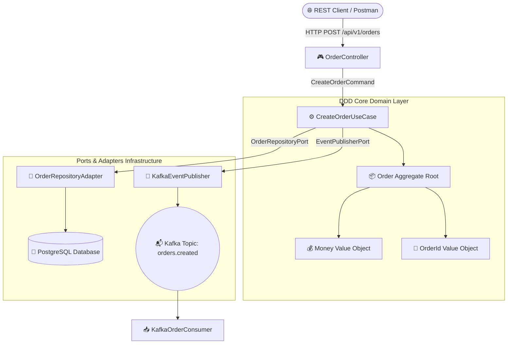

# ☕ Java 21 Event-Driven Architecture & DDD Showcase

[](https://jdk.java.net/21/)
[](https://spring.io/projects/spring-boot)
[](https://kafka.apache.org/)
[](https://www.postgresql.org/)
[](https://www.docker.com/)

> **Enterprise Production-Grade Architecture**  
> Microserviço Event-Driven desenvolvido em **Java 21** e **Spring Boot 3**, seguindo os princípios de **Clean Architecture**, **Domain-Driven Design (DDD)**, mensageria reativa com **Apache Kafka**, persistência relacional com **PostgreSQL**, migrações com **Flyway** e orquestração com **Docker Compose**.

---

## 🌟 Visão Geral da Arquitetura DDD & Hexagonal

O projeto aplica a separação rigorosa de responsabilidades do Domain-Driven Design (DDD), onde o núcleo da aplicação (Domínio) é totalmente isolado de frameworks e detalhes de infraestrutura:



---

## 🏗️ Estrutura de Camadas (Clean Architecture)

```text
java-event-driven-architecture/
├── domain/                         # Camada de Domínio Puro (Zero dependência de Spring)
│   ├── model/                      # Agregados & Value Objects (Order, Money, OrderId)
│   ├── events/                     # Eventos de Domínio (OrderCreatedEvent - Java Records)
│   └── ports/                      # Portas de Saída / Interfaces (OrderRepositoryPort)
├── application/                    # Camada de Aplicação / Casos de Uso
│   ├── usecase/                    # Regras de Aplicação (CreateOrderUseCase)
│   └── dto/                        # DTOs de Entrada e Saída (Records Java 21)
└── infrastructure/                 # Camada de Infraestrutura & Adapters
    ├── config/                     # Configurações Spring, Beans & Kafka
    ├── messaging/                  # Producers & Consumers Kafka
    ├── persistence/                # JPA Entities, Spring Data Repositories & Adapters
    └── web/                        # REST Controllers & Exception Handlers
```

---

## 🚀 Principais Tecnologias & Design Patterns

1. **Java 21 Modern Syntax:**
   - **Java Records:** Utilizados para DTOs imutáveis, Eventos de Mensageria e Value Objects.
   - **Pattern Matching & Sealed Classes:** Estruturação elegante de regras de negócio.
2. **Domain-Driven Design (DDD):**
   - Encapsulamento completo de agregados (`Order`), Value Objects (`Money`, `OrderId`) e invariantes de negócio.
3. **Event-Driven Messaging com Apache Kafka:**
   - Publicação assíncrona desacoplada do evento `orders.created` e escuta reativa via `@KafkaListener`.
4. **Flyway Database Migration:**
   - Controle versionado do schema do banco PostgreSQL (`V1__create_orders_table.sql`).

---

## ⚡ Como Executar a Aplicação

### 1. Subir a Infraestrutura (Kafka + Zookeeper + PostgreSQL)
```bash
docker-compose up -d
```

### 2. Compilar & Executar o Projeto Java
```bash
mvn clean package
mvn spring-boot:run
```

---

## 📑 Exemplo de Uso da API REST

### Criar um Novo Pedido (Event-Driven Pipeline)
**POST** `http://localhost:8080/api/v1/orders`

```json
{
  "customerId": "cust-9988",
  "amount": 250.00,
  "currency": "BRL"
}
```

#### Resposta HTTP 201 Created:
```json
{
  "orderId": "b3c7b2a1-5d4e-4f81-9f93-0182746c1a99",
  "customerId": "cust-9988",
  "totalAmount": 250.00,
  "currency": "BRL",
  "status": "CREATED",
  "createdAt": "2026-07-29T20:18:00"
}
```

---

## 📄 Licença

Distribuído sob a licença MIT. Veja `LICENSE` para mais detalhes.
