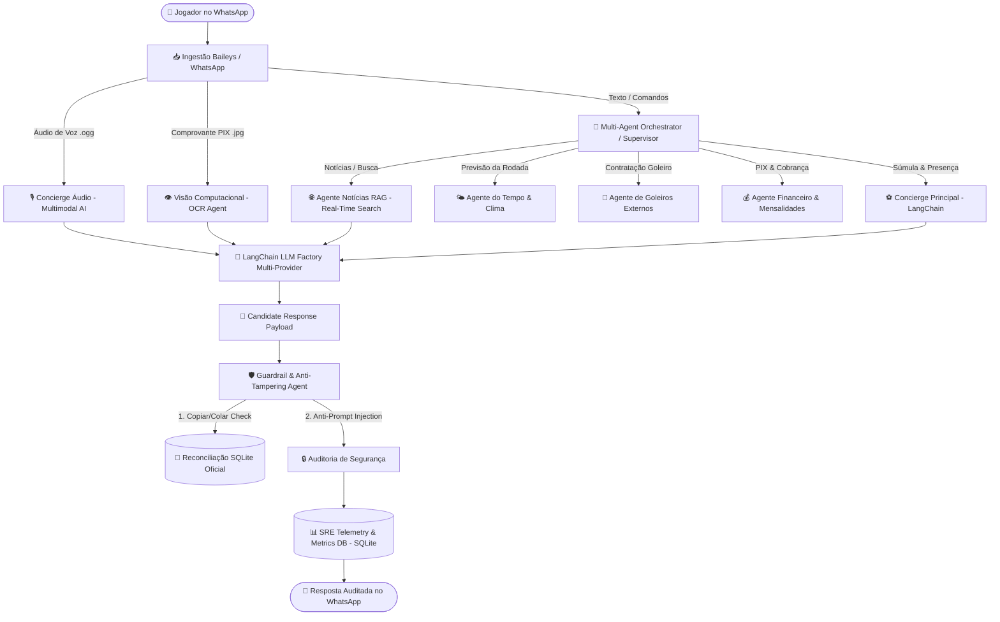

# ⚽ Joga10-AI — Sistema Multi-Agentes com LangChain, Multimodalidade & SRE Telemetry

[](https://nodejs.org/)
[](https://js.langchain.com/)
[](https://www.sqlite.org/)
[](https://sre.google/)
[](https://github.com/amricetti/artificial-intelligence)
[](LICENSE)

> **Production-Grade Multi-Agent Architecture**  
> Ecossistema agêntico autônomo desenvolvido em Node.js com **LangChain**, arquitetura **Provider-Agnostic** (Google Gemini, OpenAI GPT-4o, Anthropic Claude), **Ingestão Multimodal de Voz & Visão Computacional**, **RAG em Tempo Real**, **Prompts em 7 Seções Industriais**, **Pipeline de Guardrails Pré-Resposta** e **Motor de Telemetria SRE em Tempo Real** (SLI, SLO, TTFT, Tokens & Custos em USD/BRL).

---

## 🌟 Visão Geral da Arquitetura

O **Joga10-AI** utiliza o padrão **Supervisor / Multi-Sub-Agentes Especialistas com Guardrails Pré-Resposta**, onde nenhum sub-agente responde diretamente ao usuário final. O supervisor central roteia eventos para os agentes especialistas, cujas respostas são auditadas pela **Camada de Guardrail (`guardrailAgent.js`)** antes de serem emitidas no WhatsApp.



---

## 🚀 Módulos & Sub-Agentes Especialistas

| Agente | Tipo / Tecnologia | Responsabilidade Principal |
| :--- | :--- | :--- |
| 🛡️ **Guardrail & Reconciliação** | `guardrailAgent.js` | Interceptação pré-resposta, reconciliação de listas copiadas e auditoria anti-prompt injection. |
| 🔀 **Orquestrador Supervisor** | `orchestrator.js` | Roteamento dinâmico de intenções, chamadas de sub-agentes e controle da pipeline. |
| ⚽ **Concierge de Presença** | `agent.js` + LangChain | Gestão de escalação, confirmações (*vou*, *tô dentro*), desistências e limitação de 12 por time. |
| 🌐 **Agente Notícias RAG** | `newsAgent.js` + Web RSS | Coleta ao vivo na internet (*ge*, *ESPN*, *Banda B*) e síntese RAG de notícias de futebol. |
| 🎙️ **Concierge de Áudio** | Gemini Multimodal Audio | Transcrição fiel de voz e extração de intenções em uma única chamada. |
| 👁️ **Visão Computacional** | Gemini Multimodal Vision | OCR e auditoria automática de comprovantes de pagamento PIX. |
| 💰 **Agente Financeiro & PIX** | `financeAgent.js` | Fechamento pós-jogo, cobrança de avulsos (R$ 27) e mensalistas (R$ 81). |
| 🌤️ **Agente do Tempo** | `weatherAgent.js` + Open-Meteo | Previsão meteorológica precisa da rodada da próxima terça às 19h30. |
| 🧤 **Agente de Goleiros** | `goalkeeperAgent.js` | Registro e contratação de goleiros de aluguel de apps externos. |
| 📊 **Engenharia SRE Engine** | `sreTelemetry.js` | Telemetria de consumo de tokens, latência P50/P95, TTFT e cálculo de custos. |

---

## 💎 Destaques Arquiteturais & Engenharia

### 1. 🛡️ Pipeline de Guardrails Pré-Resposta & Reconciliação (`guardrailAgent.js`)
- **Anti Copiar-e-Colar Tampering:** Se alguém copiar a lista do WhatsApp, alterar nomes manualmente no texto e colar no grupo, o **Guardrail Agent** detecta a tentativa, extrai os nomes citados, sincroniza com o banco de dados SQLite oficial e substitui a mensagem adulterada pela **Lista Oficial do Banco de Dados**.
- **Anti-Prompt Injection Audit:** Audita o payload final para evitar injeções de código malicioso (`DELETE FROM`, `ignore previous instructions`, etc.).
- **Sub-Agentes Protegidos:** Nenhum sub-agente fala diretamente com o usuário final; todas as respostas passam primeiro pela validação do Guardrail.

### 2. 📝 Prompts Padronizados em 7 Seções Industriais
Todos os System Prompts dos sub-agentes foram construídos segundo o padrão enterprise:
1. `=== 1. OVERVIEW ===` (Identidade e papel do agente)
2. `=== 2. CONTEXT ===` (Ambiente de execução e canal)
3. `=== 3. INSTRUCTIONS & SCOPE BOUNDARIES ===` (Foco 100% em futebol e regras de recusa)
4. `=== 4. TOOLS & ACTIONS SCHEMA ===` (Schemas JSON de saída e ferramentas)
5. `=== 5. EXAMPLES ===` (Few-Shot prompting com exemplos práticos)
6. `=== 6. STANDARD OPERATING PROCEDURE (SOP) ===` (Algoritmo sequencial de execução)
7. `=== 7. FINAL NOTES & FALLBACK GUARDRAILS ===` (Mecanismos de resiliência e persona boleira)

### 3. 👑 Controle Dedicado de Mensalistas
- **Quadro Oficial Separado:** O comando `!mensalistas` exibe um relatório exclusivo com os mensalistas do mês vigente, sem misturar com a lista da partida do dia.
- **Comandos de Gerenciamento:**
  - `!mensalista [Nome]` → Adiciona um jogador como mensalista (R$ 81,00/mês).
  - `!removermensalista [Nome]` / `!avulso [Nome]` → Altera o jogador para avulso.
  - `!limparmensalistas` → Zera o quadro mensal para início de um novo ciclo.

### 4. 🤖 Arquitetura Provider-Agnostic com LangChain (`llmFactory.js`)
- Alternância dinâmica entre **Google Gemini**, **OpenAI GPT-4o**, **Anthropic Claude** ou **Ollama** via `.env`.
- Fallback por regras locais caso a API fique indisponível.

### 5. 📊 Observabilidade & Engenharia SRE (`sreTelemetry.js`)
- Telemetria por requisição (Tokens, Latência P50/P95, TTFT, Custos USD/BRL).
- SLO de 99.0% de disponibilidade com painel executivo `!sre` restrito por RBAC ao dono (**Alan**).

---

## 📋 Tabela de Comandos do WhatsApp

| Comando | Permissão | Descrição |
| :--- | :--- | :--- |
| `!lista` / `!presenca` | Todos | Exibe a escalação da partida da rodada atualizada com clima. |
| `!mensalistas` | Todos | Exibe o Quadro Oficial de Mensalistas cadastrados do mês. |
| `!limparmensalistas` | Todos | Zera o quadro de mensalistas para o próximo ciclo mensal. |
| `!removermensalista [Nome]` | Todos | Altera a categoria de um mensalista para avulso. |
| `!nome [NovoNome]` | Todos | Altera o nome dinâmico do assistente (ex: `!nome Zurg`). |
| `!agentes` | Todos | Lista todos os sub-agentes e comandos disponíveis no bot. |
| `!clima` | Todos | Consulta a previsão do tempo para a rodada às 19:30. |
| `!convocar` | Todos | Marca todos os participantes do grupo para convocação. |
| `!pix` / `!pagamentos` | Todos | Exibe o relatório de pagamentos e a chave PIX. |
| `!pago [Nome]` | Todos | Marca o pagamento de um jogador como PAGO no sistema. |
| `!mensalista [Nome]` | Todos | Cadastra o jogador como mensalista (R$ 81/mês). |
| `!novapartida` | Todos | Zera a súmula e abre uma nova lista para a próxima rodada. |
| `!sre` / `!metrics` | **Dono (Alan)** | Painel executivo SRE de tokens, custos USD/BRL, latência e SLI/SLO. |

---

## ⚡ Como Executar Localmente

### 1. Clonar o Repositório & Instalar Dependências
```bash
git clone https://github.com/amricetti/artificial-intelligence.git
cd artificial-intelligence/joga10-ai
npm install
```

### 2. Configurar o `.env`
Crie ou edite o arquivo `.env` com as suas chaves:
```env
# Provedor e Modelo LLM
GEMINI_API_KEY="SuaChaveGeminiAPI"
LLM_PROVIDER="gemini"
LLM_MODEL="gemini-3.5-flash-lite"

# Engenharia SRE & Segurança
OWNER_NAME="Alan"
USD_TO_BRL=5.65

# Configurações do Bot
BOT_NAME="Zurg"
PORT=5000
```

### 3. Iniciar o Bot
```bash
npm start
```
Escaneie o QR Code exibido no terminal com seu WhatsApp para conectar!

---

## 📄 Licença

Distribuído sob a licença MIT. Veja `LICENSE` para mais detalhes.
